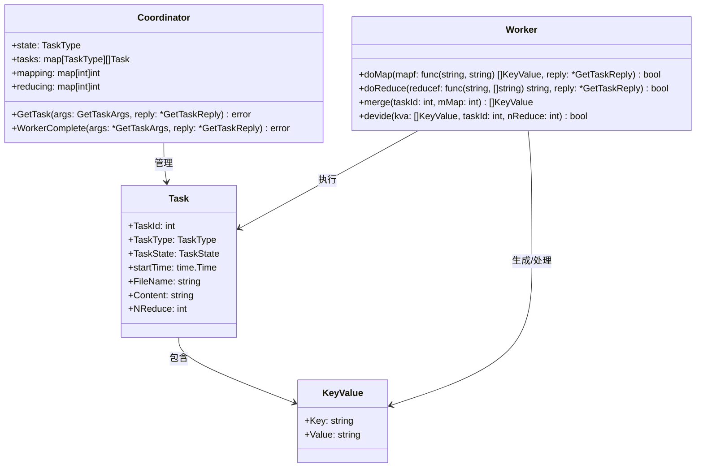
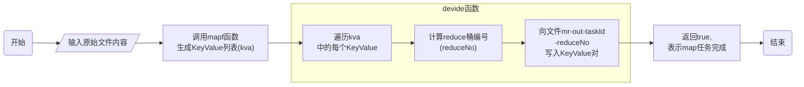
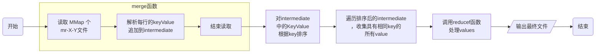
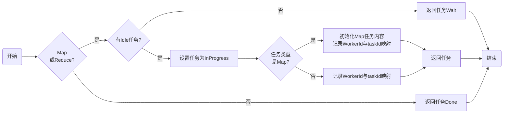
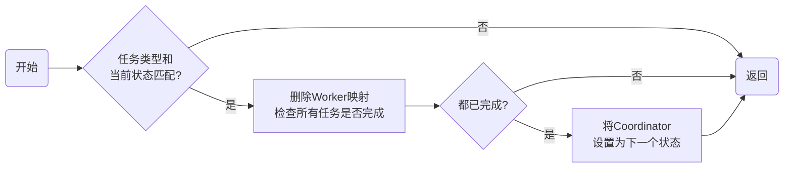

## 原理

**具体可以看[翻译的论文](../mapreduce/)**

### 系统架构


MapReduce的整体系统架构图如上图所示。总体上可以分为三个部分：Client、Master、Worker

+ 在Client中，编写的MapReduce程序提交到master端，用户可通过Client提供的一些接口查看作业运行状态。

+ 在Master中，又分为两个部分：

  + Task Scheduler负责调度mapreduce作业，它将作业分解为多个Map任务和Reduce任务，然后将这些任务分配给集群中的不同节点来处理。
  + JobTracker负责它监控任务的执行状态，负责处理来自worker的数据，并负责将数据转发与存储。同时也负责任务的失败处理。

+ 在Worker中，分为了三个部分：

  + TaskTracker任务：
    分布在集群各个节点上的工作节点，负责执行由JobTracker分配的Map和Reduce任务。每个TaskTracker节点都可以并行执行多个任务。TaskTracker会将任务的执行进度和状态报告给mastre中的JobTracker。

  + Map任务：
    Map任务是MapReduce处理的第一阶段。输入数据被分为多个分片，每个分片被分配给一个Map任务。Map任务处理数据片段，将其转化为键值对<key, value>的形式。然后，它们将这些键值存储到一定位置并告知master，以供后续的Reduce任务使用。

  + Reduce任务：
    Reduce任务是MapReduce处理的第二阶段。Reduce任务负责处理由Map任务产生的中间键值对。它将相同键的数据进行汇总和归并处理，然后输出最终的计算结果。通常，Reduce任务会聚合、筛选或合并相同键的数据，实现对Map结果的进一步处理。

### 任务流程


流程图如上图所示，关键流程有以下几步：

1. 用户程序中的MapReduce库首先将输入文件划分为M个分片，通常每个分片为16MB到64MB（用户可通过可选参数控制）。随后，库会在集群中的机器上启动程序的一些副本。
2. 这些程序的副本中，有一份很特殊，它是master副本。其他的副本是被master分配了任务的worker副本。总计要分配 M个map任务和R个reduce任务。master选取闲置的worker并为每个选取的worker分配map或reduce任务。
3. 被分配map任务的worker从输入数据分片中读取内容。其解析输入数据中的键值对，并将每个键值对传给用户定义的map函数。map函数输出的中间键值对在内存中缓存。
4. 内存中缓存的键值对会定期地写入本地磁盘，写入的数据会被分区函数划分为R个区域。这些在磁盘中缓存的键值对的位置会被发送给master，master会将这些位置信息进一步传递给reduce worker。
5. 当master通知reduce worker中间键值对的位置信息后，reduce worker会通过RPC的方式从map worker的本地磁盘中读取缓存的数据。当reduce worker读取完所有中间数据后，它会对中间数据按照键进行排序，以便将所有键相同的键值对分为一组。因为通常来说，需对键不同的数据会被映射到同一个reduce任务中，所以需要对数据排序。如果中间数据总量过大以至于无法放入内存中，则会使用外排序算法。
6. reduce worker遍历每一个遇到的中间键值对的，它会将键和该键对应的一系列值传递给用户定义的reduce函数。reduce函数的输出会被追加到该reduce分区的最终输出文件中。
7. 当所有的map和reduce任务都执行完毕后，master会唤醒用户程序。此时，调用MapReduce的调应用序会返回到用户代码中。

### 总览

本次实验最终实现的思路，其时序图如下：


实验的类图如下：



## 实现过程

### RPC

为了使得`Worker`和`Master`之间进行调用，首先要对他们之间进行沟通的内容进行规定，定义若干结构体于`rpc.go`文件中。

```go
type GetTaskArgs struct {
    WorkerId int  // Worker ID
    TaskType Type // Task Type
}

type GetTaskReply struct {
    Task     Task   // 任务
    FileName string // 文件名，提供给worker中的mapf和reducef使用
    Content  string // 文件内容，提供给worker中的mapf和reducef使用
}
```

`GetTaskArgs`中的`WorkerId`部分用于标记Worker，在单机系统中，我使用进程号来作为一个`WorkerId`。`GetTaskReply`包含三个部分：

+ `Task`是一个结构体，用来存储任务元数据。

+ `Filename`用来记录文件名，在`map`和`reduce`任务中，其起到不同的作用。

+ `Content`用来存储文件中的具体内容。在`map`任务中，`Filename`用来记录输入文件名，并将文件内容存放到`content`中。而在reduce任务中，`Filename`用来记录输出文件名，以供`reduce`任务将结果存放到指定的文件中。

### Worker

在本实验中，`worker.go` 文件实现了 MapReduce 框架中的 Worker 组件，负责执行 Map 和 Reduce 任务，并与 Coordinator 进行通信以获取任务和报告完成状态。其主要分为下面几个部分：

#### 申请任务

当`Worker`空闲时，需要不断地向`Coordinator`申请任务，具体的代码如下：

```go
// 初始化请求参数
args := GetTaskArgs{WorkerId: os.Getpid()}
reply := GetTaskReply{}
// 向Coordinator发送申请
CallGetTask(&args, &reply)
taskType := reply.Task.TaskType
// 如果接收到的任务类型为Map或Reduce，则说明要进行具体的处理
if taskType == MapType || taskType == ReduceType {
    var completed bool
    if taskType == MapType {
        completed = doMap(mapf, &reply)
    } else {
        completed = doReduce(reducef, &reply)
    }
    // 如果任务完成，则要向对方发送任务完成的通知，方便后续处理
    if completed {
        args = GetTaskArgs{WorkerId: os.Getpid(), TaskType: taskType}
        reply = GetTaskReply{}
        CallWorkerComplete(&args, &reply)
    } else {
        // 如果未能完成任务，则表示处理失败
        Debug(dError, "failed!\n")
    }
} else if taskType == Wait {
    // 如果master要求本worker执行wait，则等待一段时间后再去请求任务
    time.Sleep(1000 * time.Millisecond)
} else if taskType == Done {
    // 如果master要求本worker执行done，则表示所有任务已经完成
    Debug(dInfo, "All tasks are completed\n")
    return
}
```

#### 结构体与排序接口

```go
type KeyValue struct {
    Key   string
    Value string
}

type ByKey []KeyValue

func (a ByKey) Len() int           { return len(a) }
func (a ByKey) Swap(i, j int)      { a[i], a[j] = a[j], a[i] }
func (a ByKey) Less(i, j int) bool { return a[i].Key < a[j].Key }
```

`KeyValue` 结构体用于存储键值对，是 Map 和 Reduce 任务之间传递数据的基本单元。`Key`是一个单词，而`Value`是其出现的次数，在本实验中，若在一段内容中，一个单词`word`出现了5次，则建立5个元素，它们的内容都为`key = word && value = 1`直至进入到`reduce`阶段。
而`ByKey`排序实现了`sort.Interface`接口，用于对 `KeyValue` 切片按键进行排序，以便在 Reduce 阶段聚合同一键的值。

#### 哈希函数

```go
func ihash(key string) int {
    h := fnv.New32a()
    h.Write([]byte(key))
    return int(h.Sum32() & 0x7fffffff)
}
```

使用 `ihash(key) % NReduce` 选择每个 `KeyValue`由 Map 发出的 Reduce 任务编号。例如，如果 `NReduce`是 10，那么 `ihash(key)` 的结果将是 0 到 9 之间的整数。即，将 key 映射到特定的 reduce 桶中，例如，文档可能有 100 个不同的单词，但是只有 10 个 reduce 桶，且确保同一个键总是被分配到相同的 reduce 桶。

#### Map任务

```go
func devide(kva []KeyValue, taskId int, nReduce int) bool {
	files := make([]*os.File, nReduce)
	encoders := make([]*json.Encoder, nReduce)

	// 创造nReduce个文件
	for i := 0; i < nReduce; i++ {
		mrOutName := fmt.Sprintf(rootPath+"/intermediate/mr-out-%d-%d", taskId, i)
		file, err := os.Create(mrOutName)
		if err != nil {
			log.Fatalf("cannot create %v", mrOutName)
			return false
		}
		files[i] = file
		encoders[i] = json.NewEncoder(file)
	}
	// 将kv对写入JSON文件
	for _, kv := range kva {
		reduceNo := ihash(kv.Key) % nReduce
		if err := encoders[reduceNo].Encode(&kv); err != nil {
			log.Fatalf("cannot encode %v", kv)
			return false
		}
	}

	for _, file := range files {
		file.Close()
	}
	return true
}

func doMap(mapf func(string, string) []KeyValue, reply *GetTaskReply) bool {
	kva := mapf(reply.FileName, reply.Content)
	return devide(kva, reply.Task.TaskId, reply.Task.NReduce)
}
```

`doMap()`函数执行 Map 任务，调用用户定义的`mapf`函数处理输入文件内容，并将生成的键值对分配到 Reduce 桶中。`devide`函数将 Map 阶段生成的键值对`kva`分配到`nReduce`个 Reduce 桶中。具体步骤包括：

1. 计算每个键的哈希值并确定对应的 Reduce 编号。
2. 根据任务 ID 和 Reduce 编号构建中间文件名，文件名格式为`mr-out-taskId-reduceNo`（`taskId`为该map任务的ID，`reduceNo`为上一步确认的Reduce编号）。
3. 检查中间文件是否存在，若存在则追加写入，否则创建新文件。
4. 处理文件操作中的潜在错误。



#### Reduce任务

```go
// 将mr-X-Y文件中的内容读取到Intermediate中
func merge(taskId int, mMap int) []KeyValue {
	var intermediate []KeyValue
	// 读取所有map任务的输出文件
	for i := 0; i < mMap; i++ {
		mrOutName := fmt.Sprintf(rootPath+"/intermediate/mr-out-%d-%d", i, taskId)
		file, err := os.Open(mrOutName)
		if errors.Is(err, os.ErrNotExist) {
			continue
		}
		if err != nil {
			log.Fatalf("cannot open %v", mrOutName)
			return nil
		}
		// 读取文件内容，解析为KeyValue
		dec := json.NewDecoder(file)
		for {
			var kv KeyValue
			if err := dec.Decode(&kv); err != nil {
				break
			}
			intermediate = append(intermediate, kv)
		}
		file.Close()
	}
	return intermediate
}

func doReduce(reducef func(string, []string) string, reply *GetTaskReply) bool {
	// 将mr-X-Y文件中的内容读取到Intermediate中
	intermediate := merge(reply.Task.TaskId, reply.Task.MMap)

	// 下面的代码与mrsequential.go中的代码基本一样，只需要修改输出文件
	// 对中间数据根据key进行排序
	sort.Sort(ByKey(intermediate))
	// 创建输出文件
	oname := rootPath + "/res/mr-out-" + strconv.Itoa(reply.Task.TaskId)
	ofile, err := os.Create(oname)
	if err != nil {
		log.Fatalf("cannot create %v", oname)
		return false
	}
	defer ofile.Close()

	i := 0
	for i < len(intermediate) {
		j := i + 1
		for j < len(intermediate) && intermediate[j].Key == intermediate[i].Key {
			j++
		}
		// values是一个字符串切片，存储相同key的所有value
		values := []string{}
		for k := i; k < j; k++ {
			values = append(values, intermediate[k].Value)
		}
		// 在此时，values是["1", "1", "1", ...]，1的个数就是单词出现的次数
		output := reducef(intermediate[i].Key, values)
		fmt.Fprintf(ofile, "%v %v\n", intermediate[i].Key, output)
		i = j
	}
	return true
}
```

`doReduce()`函数执行 Reduce 任务，读取并合并中间文件内容，排序后聚合同一键的值，调用用户定义的 `reducef`函数处理，并将结果写入输出文件。`merge()`函数用于将多个 Map 任务的中间结果合并为最终的输出。具体实现包括：

1. **数据读取**：遍历所有 Map 任务生成的中间文件，读取其中的键值对。
2. **数据合并**：将读取的键值对存储到`intermediate`切片中，供后续的reduce处理使用。



#### 任务完成

任务完成之后，需要通知`coordinator`进行后续处理，在`worker`需要执行的代码：

```go
func CallWorkerComplete(args *GetTaskArgs, reply *GetTaskReply) {
	ok := call("Coordinator.WorkerComplete", args, reply)
	if !ok {
		fmt.Print("call failed!\n")
		Debug(dError, "Worker complete failed!\n")
	}
}
```

### Coordinator

#### 结构体

在本实验中，`coordinator.go`负责实现管理整个任务过程，包括，初始化任务、给`worker`分配任务、处理任务完成的后续等等。为了管理任务，需要创建一个数据结构`Coodinator`，它包含以下变量：

```go
// coordinator的属性
type Coordinator struct {
	state    Type        // coordinator状态，判断当前是在分配map任务还是reduce任务
	mMap     int         // map任务数量上限，取决于输入文件数量
	nReduce  int         // reduce任务数量上限，取决于mrcoordinator.go中的nReduce
	mapping  map[int]int // 正在执行的map任务列表，key为workerId，value为taskId
	reducing map[int]int // 正在执行的reduce任务列表，key为workerId，value为taskId
	tasks    [][]Task    // 将map任务和reduce任务合并成一个二维数组，方便简化代码，防止重复代码
}
```

#### 初始化

在创建一个`coordinator`时，需要对以上属性进行赋初值的操作，具体是在`MakeCoordinator()`中中进行下面的操作：

```go
mMap := len(files)
c := Coordinator{
    mMap:     mMap,
    nReduce:  nReduce,
    mapping:  make(map[int]int),
    reducing: make(map[int]int),
    tasks:    make([][]Task, 2),
}
mapTasks := make([]Task, mMap)
reduceTasks := make([]Task, nReduce)
for i := 0; i < mMap; i++ {
    // 初始化map任务列表
    // 将任务的状态设置为Idle，表示未分配
    // 需要初始化NReduce，因为在Worker中，需要根据NReduce来将结果划分到不同的桶中
    mapTasks[i] = Task{
        TaskType:  MapType,
        TaskState: Idle,
        TaskId:    i,
        NReduce:   c.nReduce,
        FileName:  files[i],
    }
}
for i := 0; i < nReduce; i++ {
    // 初始化reduce任务列表
    // 需要初始化MMap，因为在Worker中，需要根据MMap来读取map任务的结果
    reduceTasks[i] = Task{
        TaskType:  ReduceType,
        TaskState: Idle,
        TaskId:    i,
        MMap:      c.mMap,
    }
}
c.tasks[0] = mapTasks
c.tasks[1] = reduceTasks
```

其中`Task`结构体如下：

```go
type State int
type Type int

const (
    Idle       State = iota // 任务未分配
    InProgress              // 任务进行中
    Completed               // 任务已完成
)
const (
    MapType Type = iota
    ReduceType
    Done
    Wait // 通知worker等待
)

type Task struct {
    TaskType  Type      // 任务类型
    TaskState State     // 任务状态
    TaskId    int       // 任务编号，代表执行的是map或reduce的第几个任务
    NReduce   int       // reduce任务数量
    MMap      int       // map任务数量
    startTime time.Time // 任务开始时间
    FileName  string    // 输入/输出文件名
}
```

`Task`的更新机制如下：

1. 在`MakeCoordinator()`（`coordinator`初始化）时，将所有任务状态设置为`Idle`，不设置`StartTime`
2. 在`GetTask()`（`coordinator`给`worker`分配任务）后，将任务状态设置为`InProgress`，设置`StartTime`
3. 在`WorkerComplete()`（检测到任务完成）时，将任务状态设置为`Completed`，不设置`StartTime`
4. 在`CheckTimeOut()`（检测到`worker`超时）时，将任务状态设置为`Idle`，以备之后的`worker`进行申请，且不设置`StartTime`。

#### 分配任务

当`worker`空闲并向自己发送任务申请时，`coordinator`需要根据现在所处的阶段以及剩余任务的状态来进行任务的分配。具体实现如下：

```go
func (c *Coordinator) GetTask(args *GetTaskArgs, reply *GetTaskReply) error {
	mutex.Lock()
	defer mutex.Unlock()
	if c.state == MapType || c.state == ReduceType {
		taskId := 0
		// 遍历map任务或reduce任务，找到第一个状态为Idle的任务
		for ; taskId < len(c.tasks[c.state]); taskId++ {
			if c.tasks[c.state][taskId].TaskState == Idle {
				break
			}
		}
		// 若未找到Idle的任务，则将任务状态设置为Wait，通知worker等待
		if taskId == len(c.tasks[c.state]) {
			reply.Task = Task{TaskType: Wait}
			return nil
		}
		// 如果是map任务，则需要初始化map任务的content
		if c.state == MapType {
			reply.FileName = c.tasks[0][taskId].FileName
			c.initMapContent(reply)
			c.mapping[args.WorkerId] = taskId
		} else {
			c.reducing[args.WorkerId] = taskId
		}
		// 将任务状态设置为InProgress，更新StartTime，用以判断任务是否超时
		c.tasks[c.state][taskId].TaskState = InProgress
		c.tasks[c.state][taskId].startTime = time.Now()
		reply.Task = c.tasks[c.state][taskId]
	} else if c.state == Done {
		reply.Task = Task{TaskType: Done}
	}
	return nil
}
```

其中，总任务有以下几种状态

+ 若有map任务闲置，则状态为`MapType`

+ 若所有map任务都已完成，则状态为`ReduceType`

+ 若正在等待map或reduce任务完成，则状态为`InProgress`

+ 若所有reduce任务都已完成，则状态为`Done`

下面的流程图可以大致总结上面的代码：



#### 判断任务是否完成

```go
// 如果任务类型和当前的状态都匹配，则将任务状态设置为Completed
if args.TaskType == c.state {
    taskId := 0
    var taskType string
    if args.TaskType == MapType {
        taskId = c.mapping[args.WorkerId]
        delete(c.mapping, args.WorkerId)
        taskType = "map"
    } else {
        taskId = c.reducing[args.WorkerId]
        delete(c.reducing, args.WorkerId)
        taskType = "reduce"
    }
    c.tasks[c.state][taskId].TaskState = Completed

    for _, task := range c.tasks[c.state] {
        if task.TaskState != Completed {
            return nil
        }
    }

    // 将状态设置为下一个状态
    // MapType的下一个状态是ReduceType，ReduceType的下一个状态是Done
    Debug(dInfo, "All %s tasks are completed\n", taskType)
    c.state += 1
}
return nil
```

在worker的部分，设置在完成任务之后，需要通过RPC向`coordinator`来处理后续，因此需要在这里实现，逻辑比较简单：

1. 在分配任务时，将`workerID`与`taskID`对应了起来并放在了`c.mapping`或`c.reducing`中，因此在任务结束时，需要将其从`c.mapping`或`c.reducing`中移除。但是需要注意的是，并不是每接收到一个调用请求，就进行删除操作，因为可能有一些过时的操作，例如一个`worker1`未在规定的时间内完成任务，然后`coordinator`将该任务分配给了其他`worker2`，当`worker1`超时完成了任务并发送调用，该调用实际上不应该被执行。
2. 在上述步骤执行之后，需要将`c.tasks`中对应的任务状态置为`Completed`。
3. 然后判断本阶段的任务是否都完成，如果都完成，就进入下一个阶段。

将代码总结如下图：



#### 判断所有任务是否完成

程序需要一个退出条件——所有任务都已经结束。这一段代码比较简单：

```go
func (c *Coordinator) Done() bool {
	// 依次遍历map任务和reduce任务，判断任务状态是否为Completed
	mutex.Lock()
	defer mutex.Unlock()
	for _, task := range append(c.tasks[0], c.tasks[1]...) {
		if task.TaskState != Completed {
			return false
		}
	}
	return true
}
```

## 结果


## 优化

### 检测超时

因为执行过程的不确定性，有一些`worker`可能在执行过程出错，或由于网络问题，`worker`无法及时将结果返回给`coordinator`。为了提高效率需要进行超时处理。

```go
for {
    time.Sleep(3 * time.Second)
    mutex.Lock()
    if c.state == MapType {
        for workerId, taskId := range c.mapping {
            if time.Since(c.tasks[0][taskId].startTime) > time.Duration(maxTime)*time.Second {
                c.tasks[0][taskId].TaskState = Idle
                delete(c.mapping, workerId)
            }
        }
    } else if c.state == ReduceType {
        for workerId, taskId := range c.reducing {
            if time.Since(c.tasks[1][taskId].startTime) > time.Duration(maxTime)*time.Second {
                c.tasks[1][taskId].TaskState = Idle
                delete(c.reducing, workerId)
            }
        }
    }
    mutex.Unlock()
}
```

在任务分配时，本地都会存储任务的开始时间，在判断超时时，只需要将当前时间与`starttime`进行比较，判断是否超出规定时间。使用一个线程，每隔3秒就执行一轮检查。检查的步骤为：遍历与当前状态相符合的正在进行的任务列表，如果某一个任务超时，则将其从列表中删除，并将其状态重新置为`idle`以便分配给其他`worker`。

为了减少当前主线程的负担，可以选择开辟一个线程来执行上面的操作，可以在`main/mrcoordinator.go`中`m := mr.MakeCoordinator(os.Args[1:], 10)`之后添加`go m.CheckTimeOut(10)`，含义是使用一个线程，不断检测是否有任务超时，且超时时间设置为10s。

### 锁

在执行时，需要考虑对共享资源的访问控制，因此，需要对在适当位置添加锁。使用

```go
mutex.Lock()
defer mutex.Unlock()
```

来进行加锁与解锁的操作。其次，需要考虑锁的粒度与位置，在`worker`进程中，不需要进行加锁，因为每个worker只有一个单线程来访问数据文件，将执行的结果存储到相应的文件中。

但是在`coordinator`中，考虑到上一步所要执行的操作——开辟线程检测是否超时，该线程可能会与主线程在同一时刻访问资源，因此需要在一切可能引起冲突的地方添加锁。但是由于细粒度的锁（仅在读写语句前后加锁解锁）太复杂，导致代码非常冗长，所以更好的解决方案是，一旦某个函数要访问资源，就在该函数开始处加锁，在函数结束时解锁。虽然可能性能方面不如细粒度锁，因为一个函数可能会执行很长时间，导致其他操作无法及时访问，但是却方便实现很多，正如在mit6.824课上助教所说的，当前的目标是能够实现正确的效果。

### 输出文件格式

Worker 的 map 任务代码需要一种方法将中间键/值对存储在文件中，以便在 Reduce 任务期间可以正确读回。一种可能性是使用 Go 的 `encoding/json` 包。要将 JSON 格式的键/值对写入打开的文件：

```go
enc := json.NewEncoder(file)
for _, kv := ... {
	err := enc.Encode(&kv)
```

并读回这样的文件：

```go
dec := json.NewDecoder(file)
for {
	var kv KeyValue
	if err := dec.Decode(&kv); err != nil {
  		break
	}
	kva = append(kva, kv)
}
```

因此需要修改相应的代码：

```go
func devide(kva []KeyValue, taskId int, nReduce int) bool {
	files := make([]*os.File, nReduce)
	encoders := make([]*json.Encoder, nReduce)
	// 写入JSON
	for i := 0; i < nReduce; i++ {
		mrOutName := fmt.Sprintf(rootPath+"/intermediate/mr-out-%d-%d", taskId, i)
		file, err := os.Create(mrOutName)
		if err != nil {
			log.Fatalf("cannot create %v", mrOutName)
			return false
		}
		files[i] = file
		encoders[i] = json.NewEncoder(file)
	}

	for _, kv := range kva {
		reduceNo := ihash(kv.Key) % nReduce
		if err := encoders[reduceNo].Encode(&kv); err != nil {
			log.Fatalf("cannot encode %v", kv)
			return false
		}
	}
	for _, file := range files {
		file.Close()
	}
	return true
}

func merge(taskId int, mMap int) []KeyValue {
	var intermediate []KeyValue
	for i := 0; i < mMap; i++ {
		mrOutName := fmt.Sprintf(rootPath+"/intermediate/mr-out-%d-%d", i, taskId)
		file, err := os.Open(mrOutName)
		if errors.Is(err, os.ErrNotExist) {
			continue
		}
		if err != nil {
			log.Fatalf("cannot open %v", mrOutName)
			return nil
		}
		// 读取JSON
		dec := json.NewDecoder(file)
		for {
			var kv KeyValue
			if err := dec.Decode(&kv); err != nil {
				break
			}
			intermediate = append(intermediate, kv)
		}
		file.Close()
	}
	return intermediate
}
```

### Combine

MapReduce论文中描述：

> 在某些情况下，每个 map 任务产生的中间键可能会有很多重复，而且用户定义的 Reduce 函数具有可交换和可结合的特性。一个典型的例子是第 2.1 节中的单词计数案例。由于单词出现的频率通常遵循 Zipf 分布，每个 map 任务可能会生成数百或数千条 <the, 1> 这种格式的记录。所有这些计数结果都会被发送到同一个 reduce 任务，并由 Reduce 函数合并成一个总数。为了优化这个过程，我们允许用户指定一个可选的 Combiner 函数，这个函数可以在数据发送到网络之前对数据进行局部合并。
>
> Combiner 函数在执行 map 任务的每台机器上运行。通常，相同的代码被用于实现 combiner 函数和 reduce 函数。reduce 函数与 combiner 函数之间的唯一区别在于 MapReduce 库处理函数输出的方式不同。reduce 函数的输出会直接写入最终的输出文件，而 combiner 函数的输出则被写入一个中间文件，该文件随后会被发送到 reduce 任务进行处理。
>
> 局部合并大大加快了一些特定类型的 MapReduce 操作。附录 A 中提供了一个使用 combiner 函数的示例。

对于`wordCount`，根据上一步优化中的`json`格式表示，其每一行都为：`{"Key":"hello","Value":"1"}`，其中的`hello`需要替换为具体出现的单词，若不使用 Combine，则很有可能，经过 Map 阶段之后的某一中间文件（例如`mr-out-1-1`），其可能包含上百上千行的`{"Key":"hello","Value":"1"}`，若传输到网络上，则可能文件过大导致一定的网络拥塞。因此，为了减少此类影响，可以将相同`Key`的所有行替换为一行，例如将123行`{"Key":"hello","Value":"1"}`经过 Combine 替换成`{"Key":"hello","Value":"123"}`。以此可以大大减少行数。

但是经过分析，发现该 Combine 仅适用于特定场景，例如`wordCount`，而对于题目中给的`indexer.go`来说，则考虑得更加复杂。其中间输出为：

```json
{"Key":"success","Value":"../data/pg-being_ernest.txt"}
{"Key":"considerably","Value":"../data/pg-being_ernest.txt"}
{"Key":"seven","Value":"../data/pg-being_ernest.txt"}
{"Key":"returns","Value":"../data/pg-being_ernest.txt"}
```

`Key`为单词，`Value`为其出现的文档名。
其最终生成的文件每一行类似于：

```sh
A 8 ../data/pg-being_ernest.txt,../data/pg-dorian_gray.txt,../data/pg-frankenstein.txt,../data/pg-grimm.txt,../data/pg-huckleberry_finn.txt,../data/pg-metamorphosis.txt,../data/pg-sherlock_holmes.txt,../data/pg-tom_sawyer.txt
ABOUT 1 ../data/pg-tom_sawyer.txt
```

显然，无法通过类似于`wordCount`的Combine操作来处理`indexer`。因为实现 Combine 需要考虑到各种不同的任务，因此本实验并没有做 Combine。
