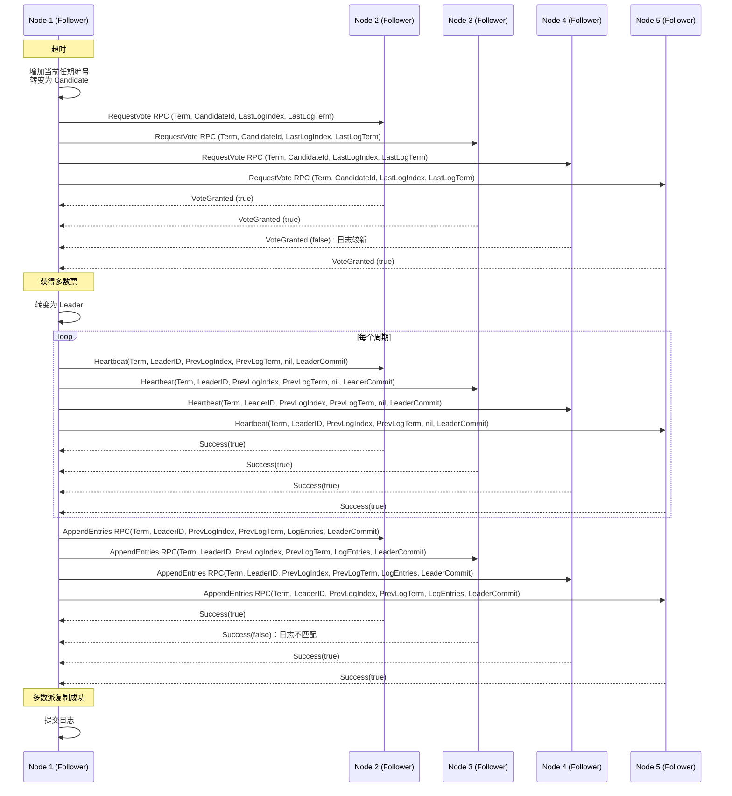

## 原理

**具体可以看[翻译的论文](../raft/)。**

### 状态转换图

Raft的系统主要包含节点角色、领导者选举和日志复制。Raft算法基于复制状态机模型，将集群中的节点分为领导者（Leader）、追随者（Follower）和候选者（Candidate）三种角色。

+ 领导者：负责处理所有客户端请求，并将操作同步到其他节点，确保系统在出现故障时仍能保持一致性。

+ 追随者：响应领导者的请求并保存日志条目，通常处于被动状态。追随者向领导者发送心跳以维持领导地位。

+ 候选者：在选举过程中，节点可以变为候选者，尝试成为领导者。候选者通过请求投票来获得足够的支持。

三种状态之间的转换如下：


### 任务流程

在不发生特殊情况的前提下，该系统进行领导者选举、日志复制的时序图如下：



其主要可以分为两个部分：领导者选举和日志复制：

#### 领导者选举

Raft算法通过心跳机制和选举超时时间来触发领导选举，确保分布式系统中的一致性和高可用性：

1. 领导者定期向所有跟随者发送心跳信息（不携带任何日志条目的AppendEntries RPC），以维持其领导地位并阻止新的选举发生。
2. 如果跟随者在设定的选举超时时间内没有收到领导者的心跳，它会认为当前没有有效的领导者，并转变为候选者状态。为了防止投票决裂，Raft使用了随机的选举超时时间，这样大多数情况下只有单个服务器会超时并赢得选举。一旦发生了决裂，。每个candidate在开始选举时重置其随机选举超时时间的计时器，且它会在下一次选举开始前等待该超时时间流逝，这减少了新的选举中再次发生投票决裂的可能性。
3. 每个任期由单调递增的数字标识，候选者在发起选举时会增加自己的任期号，以确保选举的新鲜性和避免重复选举。候选者会向集群中的其他节点发送请求投票消息，寻求它们的支持。如果候选者在选举超时时间内获得了超过半数节点（法定人数）的投票，它将成为新的领导者。

#### 日志复制

领导者接收客户端请求：当客户端向集群发送一个写操作请求时，领导者会将该请求作为一个新的日志条目追加到其本地日志中。

1. 领导者将新的日志条目追加到其本地日志中，并为其分配一个递增的索引值。
2. 领导者通过并行地向所有跟随者发送AppendEntries RPC请求来复制日志条目。这些请求不仅包含日志条目本身，还包含前一个日志条目的索引和任期号，以确保一致性。跟随者在收到AppendEntries RPC请求后，会检查请求中的前一个日志条目的索引和任期号是否与自己的日志匹配。如果匹配，它会将新的日志条目追加到自己的日志中，并返回成功响应给领导者。如果不匹配，跟随者会拒绝该请求，并返回失败响应。
3. 为了使追随者的日志和领导者自己的日志一致，领导者必须找到二者的日志中最新的一致的日志条目，删除追随者日志中该点后的所有条目，并将领导者日志中该点后的所有条目发送给追随者。领导者会为每个追随者维护一个nextIndex，它是领导者将发送给该追随者的下一条日志的index。当领导者首次掌权时，它会将所有的nextIndex值初始化为其日志的最后一个条目的下一个index。如果追随者的日志与领导者的不一致，下一次AppendEntries RPC中的一致性检验会失败。**当RPC被拒绝后，领导者会减小该nextIndex并重试AppendEntries RPC。** 最终，nextIndex会达到领导者和追随者的日志匹配的点。这时，AppendEntries会成功，它会删除追随者日志中任何冲突的条目，并将日志条目从领导者的日志中追加到追随者的日志中。如下图所示：


4. 一旦领导者从大多数跟随者那里收到了对新日志条目的确认，它会将该日志条目标记为已提交，并将其应用到状态机中。然后，领导者会通知所有跟随者提交该日志条目。跟随者在收到提交通知后，会将相应的日志条目应用到它们的状态机中，从而确保整个集群的状态一致。

## 实验过程

### 准备

#### 服务器状态

根据论文，对于服务器，相关的属性如下表：

<table style="border: 4px solid #285daa; border-collapse: collapse; text-align: left">
        <th colspan="3" align="center" style="background-color: #285daa;
        color: white;
        padding: 12px;
        text-align: center;">
            State
        </th>
        <tr>
            <th rowspan="3" style="color: #a7001e;">所有服务器上的持久性状态（在响应 RPC 之前更新稳定存储）</th>
            <th>currentTerm</th>
            <td>服务器见过的最新任期（首次启动时初始化为 0，单调增加）</td>
        </tr>
        <tr>
            <th>votedFor</th>
            <td>在当前任期内获得投票的候选者的ID（如果没有则为 null）</td>
        </tr>
        <tr>
            <th>log[]</th>
            <td>日志条目；每个条目包含状态机命令以及领导者收到条目时的任期（第一个索引为 1）</td>
        </tr>
        <tr>
            <th rowspan="2" style="color: #a7001e;">所有服务器上的易失状态</th>
            <th>commitIndex</th>
            <td>已知已提交的最高日志条目的索引（初始化为 0，单调增加）</td>
        </tr>
        <tr>
            <th>lastApplied</th>
            <td>应用于状态机的最高日志条目的索引（初始化为 0，单调增加）</td>
        </tr>
        <tr>
            <th rowspan="2" style="color: #a7001e;">领导者服务器上的易失状态（选举后重新初始化）</th>
            <th>nextIndex[]</th>
            <td>对于每个服务器，发送到该服务器的下一个日志条目的索引（初始化为领导者最后一个日志索引 + 1）</td>
        </tr>
        <tr>
            <th>matchIndex[]</th>
            <td>对于每个服务器，已知在服务器上复制的最高日志条目的索引（初始化为 0，单调增加）</td>
        </tr>
</table>

具体体现在代码中：

```go
// A Go object implementing a single Raft peer.
type Raft struct {
	mu        sync.Mutex          // Lock to protect shared access to this peer's state
	peers     []*labrpc.ClientEnd // RPC end points of all peers
	persister *Persister          // Object to hold this peer's persisted state
	me        int                 // this peer's index into peers[]
	dead      int32               // set by Kill()
	applyCh   chan ApplyMsg       // 服务或测试人员希望Raft发送ApplyMsg消息的通道
	applyCond *sync.Cond          // 用于通知applyCh有新的日志条目需要应用

	// 所有服务器上的持久性状态（在响应 RPC 之前更新稳定存储）
	currentTerm int        // 服务器最后一次知道的任期号（初始化为 0，持续递增）
	votedFor    int        // 在当前任期内获得投票的候选者的ID（如果没有则为 null）
	log         []LogEntry // 日志条目集；每个条目包含状态机命令以及领导者收到条目时的任期（第一个索引为 1）
	recvdIndex  int        // 已知收到的最后一个日志条目的索引，即为日志长度-1，（初始化为 0，单调增加）

	// 所有服务器上的易失性状态
	commitIndex     int           // 已知已提交的最高日志条目的索引（初始化为 0，单调增加）
	lastApplied     int           // 应用于状态机的最高日志条目的索引（初始化为 0，单调增加）
	state           int           // 服务器的状态（跟随者、候选者、领导者）
	updateTime      time.Time     // 上次收到心跳的时间，或开始选举的时间
	electionTimeout time.Duration // 选举超时时间

	// 领导者服务器上的易失状态（选举后重新初始化）
	nextIndex     []int         // 对于每个服务器，发送到该服务器的下一个日志条目的索引（初始化为领导者最后一个日志索引 + 1）
	matchIndex    []int         // 对于每个服务器，已知在服务器上复制的最高日志条目的索引（初始化为 0，单调增加）
	heartBeatTime time.Duration // 心跳超时时间
}
```

在程序启动时，需要对节点变量进行初始化：

```go
func Make(peers []*labrpc.ClientEnd, me int,
	persister *Persister, applyCh chan ApplyMsg) *Raft {
	rf := &Raft{}
	rf.peers = peers
	rf.persister = persister
	rf.me = me
	// 初始化状态
	rf.state = Follower
	// 心跳时间，因测试要求每秒不多于10次/秒
	// 选举超时时间，大于论文中的300ms，且需要随机化
	rf.heartBeatTime = 120 * time.Millisecond
	rf.electionTimeout = time.Duration(360+rand.Intn(360)) * time.Millisecond
	rf.updateTime = time.Now()
	rf.currentTerm = 0           // 任期号
	rf.votedFor = -1             // 未投票
	rf.log = make([]LogEntry, 1) // 索引从1开始
	rf.log[0] = LogEntry{0, nil} // 第0个日志条目为空
	rf.commitIndex = 0           // 已知已提交的最高日志条目的索引
	rf.recvdIndex = 0            // 已知收到的最后一个日志条目的索引
	rf.nextIndex = make([]int, len(rf.peers))
	rf.matchIndex = make([]int, len(rf.peers))

	rf.applyCh = applyCh
	rf.applyCond = sync.NewCond(&rf.mu)

	rf.readPersist(persister.ReadRaftState())

	go rf.ticker()   // 开辟一个goroutine，用于处理心跳和选举
	go rf.applyLog() // 开辟一个goroutine，用于应用日志
	return rf
}
```

#### 服务器规则

<table style="border: 4px solid #285daa; border-collapse: collapse; text-align: left">
        <th colspan="3" style="background-color: #285daa;
        color: white;
        padding: 12px;
        text-align: center;">
            Rules for Servers
        </th>
        <tr>
            <th style="color: #a7001e;">所有服务器：</th>
            <td colspan="2">
                <ul>
                    <li>如果 commitIndex > lastApplied：增加 lastApplied，将 log[lastApplied] 应用到状态机（§5.3）</li>
                    <li>如果RPC请求或响应包含的任期 T > currentTerm：设置currentTerm = T，转换为跟随者（§5.1）。</li>
                </ul>
            </td>
        </tr>
        <tr>
            <th style="color: #a7001e;">跟随者（§5.2）:</th>
            <td colspan="2">
                <ul>
                    <li>回应候选者和领导者的 RPC</li>
                    <li>如果选举超时后没有收到来自当前领导者的 AppendEntries RPC 或向候选者授予投票：转换为候选者</li>
                </ul>
            </td>
        </tr>
        <tr>
            <th style="color: #a7001e;">候选者（§5.2）:</th>
            <td colspan="2">
                <ul>
                    <li>转换为候选者后，开始选举：</li>
                    <ul>
                        <li>增加 currentTerm</li>
                        <li>为自己投票</li>
                        <li>重置选举计时器</li>
                        <li>向所有其他服务器发送 RequestVote RPC</li>
                    </ul>
                    <li>如果从大多数服务器收到选票：成为领导者</li>
                    <li>如果从新领导者收到 AppendEntries RPC：转换为跟随者</li>
                    <li>如果选举超时：开始新的选举</li>
                </ul>
            </td>
        </tr>
        <tr>
            <th style="color: #a7001e;">领导者：</th>
            <td colspan="2">
                <ul>
                    <li>当选后：向每个服务器发送初始的空 AppendEntries RPC（心跳）；在空闲期间重复以防止选举超时（§5.2）</li>
                    <li>如果从客户端收到命令：将条目附加到本地日志，在条目应用到状态机后响应（§5.3）</li>
                    <li>如果 lastLogIndex ≥ 跟随者的 nextIndex：发送包含从 nextIndex 开始的日志条目的 AppendEntries RPC</li>
                    <ul>
                        <li>如果成功：更新跟随者的 nextIndex 和 matchIndex（§5.3）</li>
                        <li>如果 AppendEntries 因日志不一致而失败：递减 nextIndex 并重试（§5.3）</li>
                    </ul>
                    <li>如果存在一个 N 使得 N > commitIndex，且大多数 matchIndex[i] ≥ N，并且 log[N].term == currentTerm：设置 commitIndex
                        = N（§5.3，§5.4）。</li>
                </ul>
            </td>
        </tr>
    </table>


#### ticker()

首先，为了让所有节点定期发送心跳，或启动选举，需要设置一个ticker来进行定期检查：

```go
func (rf *Raft) ticker() {
	for !rf.killed() {
		// 无论是何种状态，都先休眠heartBeatTime时间
		time.Sleep(rf.heartBeatTime)
		rf.mu.Lock()
		// 如果是领导者，则每过一个heartbeat时间发送一次心跳
		if rf.state == Leader {
			rf.entriesToAll()
		}

		// 如果是跟随者，则检测距离上次收到心跳的时间是否超过了选举超时时间
		// 如果超过了，则启动新选举
		if (rf.state == Follower || rf.state == Candidate) && time.Since(rf.updateTime) > rf.electionTimeout {
			rf.leaderElection()
		}
		rf.mu.Unlock()
	}
}
```

在ticker中，需要处理两件事：

1. 如果是领导者，则发送心跳；
2. 如果最近选举超时时间内没有收到心跳，则启动新选举。


### 领导者选举

原论文所示的领导者选举规则如下：

<table style="border: 4px solid #285daa; border-collapse: collapse; text-align: left">
        <th colspan="3" align="center" style="background-color: #285daa;
        color: white;
        padding: 12px;
        text-align: center;">
            RequestVote RPC
        </th>
        <tr>
            <td colspan="3" style="color:#1f4899" align="center">由候选者调用来收集选票（§5.2）。</td>
        </tr>
        <tr>
            <th rowspan="4" style="color: #a7001e;">参数：</th>
            <th>term</th>
            <td>候选者的任期</td>
        </tr>
        <tr>
            <th>candidateID</th>
            <td>正在请求投票的候选者</td>
        </tr>
        <tr>
            <th>lastLogIndex</th>
            <td>候选者最后一个日志条目的索引（§5.4）</td>
        </tr>
        <tr>
            <th>lastLogTerm</th>
            <td>候选者最后一次日志条目的任期（§5.4）</td>
        </tr>
        <tr>
            <th rowspan="2" style="color: #a7001e;">结果：</th>
            <th>term</th>
            <td>currentTerm，供候选者自行更新</td>
        </tr>
        <tr>
            <th>voteGranted</th>
            <td>true 表示候选者获得选票</td>
        </tr>
        <tr>
            <th style="color: #a7001e;">接收者实现：</th>
            <td colspan="2">
                <ol>
                    <li>如果 term < currentTerm 就返回 false</li>
                    <li>如果 votedFor 为空或为 candidateId，并且候选者的日志至少和接收者一样新，就投票给候选者（§5.2, §5.4）</li>
                </ol>
            </td>
        </tr>
    </table>

据此设计出来的状态图如下：


#### 数据结构

定义结构体`RequestVoteArgs`和`RequestVoteReply`来负责在`Candidate`和`Follower`之间传递消息：

```go
type RequestVoteArgs struct {
	Term         int // 候选者的任期号
	CandidateID  int // 请求选票的候选者的ID
	LastLogIndex int // 候选者的最后日志条目的索引
	LastLogTerm  int //	候选者最后一次日志条目的任期（§5.4）
}

type RequestVoteReply struct {
	Term        int  // currentTerm，供候选者自行更新
	VoteGranted bool // true 表示候选者获得选票
}
```

为了控制与记录选举时的投票结果，还需要一个结构体`VoteController`：

```go
type VoteController struct {
	wg            sync.WaitGroup   // 用于等待所有的RPC请求完成
	receivedCount int              // 用于记录已经接收到的数量
	voteCount     int              // 用于记录已经投票成功的数量
	voteCh        chan bool        // 用于通知RPC请求完成
	timeout       <-chan time.Time // 用于超时控制
	term          int              // 用于记录发出请求时的任期
}
```

#### 发送方

**`leaderElection()`**

```go
func (rf *Raft) leaderElection() {
	// 设置当前节点为自己选举的候选者，并增加任期编号
	me := rf.me
	rf.currentTerm++
	rf.votedFor = me
	rf.state = Candidate
	rf.resetTime() // 重置选举超时计时器
	// 生成RequestVote RPC参数
	args := RequestVoteArgs{
		Term:         rf.currentTerm, // 当前任期
		CandidateID:  me,
		LastLogIndex: rf.recvdIndex,
		LastLogTerm:  rf.log[rf.recvdIndex].Term,
	}
	// 初始化投票控制结构
	voteCtrl := VoteController{
		wg:        sync.WaitGroup{},
		voteCount: 1,
		voteCh:    make(chan bool, len(rf.peers)-1),
		timeout:   time.After(rf.electionTimeout),
		term:      rf.currentTerm,
	}
	// 向其他服务器发送RequestVote RPC
	for i := range rf.peers {
		if i != me {
			voteCtrl.wg.Add(1)
			go rf.voteToSingle(i, &args, &voteCtrl)
		}
	}
	// 开辟一个goroutine，等待所有投票协程完成
	go func() {
		voteCtrl.wg.Wait()
		close(voteCtrl.voteCh)
	}()
	// 开辟一个goroutine，处理投票回复
	go rf.waitVoteReply(&voteCtrl)
}
```

`leaderElection()`用于发起领导者选举，上面的代码做了三件事：

1. **初始化投票请求参数**：当前节点将自己设置为候选者，增加任期编号，为自己投票，并重置选举超时计时器；构建投票请求，其中包含了自身的一些信息；初始化投票控制结构，用于管理和同步投票过程。
2. **并发发送投票请求**：遍历所有对等节点，对于每个非自身的节点，启动一个新的协程来调用`voteToSingle`方法，向该节点发送`RequestVote` RPC请求；同时，使用`voteCtrl.wg.Add(1)`来记录待完成的任务数量。

3. **处理投票结果**：启动一个协程，使用`voteCtrl.wg.Wait()`等待所有投票请求发送完毕后关闭投票通道`voteCtrl.voteCh`，以通知处理投票回复的协程不再接收新的投票；启动另一个协程，调用`waitVoteReply`方法来处理从其他服务器接收到的投票回复。这个方法会检查是否有足够的投票使当前节点成为领导者，或者处理其他可能的情况，如任期变化或选举超时。

**`voteToSingle()`**

```go
func (rf *Raft) voteToSingle(server int, args *RequestVoteArgs, voteCtrl *VoteController) {
	defer voteCtrl.wg.Done()
	reply := RequestVoteReply{}
	if rf.sendRequestVote(server, args, &reply) {
		rf.mu.Lock()
		defer rf.mu.Unlock()
		// 如果回复的任期大于当前任期，则更新当前任期
		if reply.Term > rf.currentTerm {
			rf.setNewTerm(reply.Term)
			rf.resetTime()
			rf.updateTime = time.Now()
			voteCtrl.voteCh <- false
			return
		}
		voteCtrl.voteCh <- reply.VoteGranted
	} else {
		// 如果发送失败，则认为投票失败
		voteCtrl.voteCh <- false
	}
}
```

`voteToSingle()`负责将投票请求发送给某个跟随者，并且处理单个回复。其运行逻辑有以下规则：

+ 如果RPC请求包含的任期 T > currentTerm：设置currentTerm = T，转换为跟随者（§5.1）。
+ 如果RPC发送失败：则视为对方未投票给本候选者。
+ 不论结果如何，都算作请求完成。

**`waitVoteReply`**

```go
func (rf *Raft) waitVoteReply(voteCtrl *VoteController) {
	for {
		rf.mu.Lock()
		state, curTerm := rf.state, rf.currentTerm
		rf.mu.Unlock()
		// 如果当前任期已经改变或者不是候选者状态，则不再处理
		if state == Candidate && curTerm == voteCtrl.term {
			select {
			// 使用 select 语句来同时监听两个通道：
			// 投票通道: 接收其他节点的投票回复。
			// 超时通道: 检测选举是否超时。
			case voteGranted, ok := <-voteCtrl.voteCh:
				rf.mu.Lock()
				if rf.currentTerm != voteCtrl.term || rf.state != Candidate {
					rf.mu.Unlock()
					return
				}
				// 如果投票通道关闭 (!ok)，则将 voteCtrl.voteCh 置为 nil，
				// 表示不再接收新的投票。
				if !ok {
					voteCtrl.voteCh = nil
					rf.mu.Unlock()
					return
				} else if voteGranted {
					voteCtrl.voteCount++
				}
				// 如果获得了大多数的投票，则成为领导者
				if voteCtrl.voteCount > len(rf.peers)/2 {
					rf.state = Leader
					// 向其他服务器发送日志
					// 此日志不一定是空的，因为可能领导者和其他服务器之间的日志不一致
					for i := range rf.nextIndex {
						rf.nextIndex[i] = rf.recvdIndex + 1
						rf.matchIndex[i] = 0
					}
					rf.recvdIndex = len(rf.log) - 1
					rf.entriesToAll()
					rf.mu.Unlock()
					return
				}
				rf.mu.Unlock()
			case <-voteCtrl.timeout:
                // 如果选举超时
				rf.mu.Lock()
				if rf.currentTerm != voteCtrl.term || rf.state != Candidate {
					rf.mu.Unlock()
					return
				}
				rf.setNewTerm(rf.currentTerm)
				rf.resetTime()
				rf.mu.Unlock()
				return
			}
		} else {
			return
		}
	}
}
```

候选者循环等待投票回复，先检查当前节点是否仍处于候选者状态并保持相同任期，后使用 select 语句来同时监听两个通道：

+ 投票通道: 接收其他节点的投票回复。当接收到投票回复时，一定要先确保当前任期和投票请求时的任期相同，且当前状态为候选者。因为需要考虑到下面两种情况：

  + 对方的回复超时，而本候选者在收到回复时，已经更新了自己的任期。
  + 本候选者成为了跟随者或领导者，不能违规去处理属于之前候选者状态时应当处理的回复。

  然后根据投票结果进行判定，若收到大部分选票，则成为领导者，更新自身状态，并向跟随者发送心跳，在心跳中，需要实现将跟随者的日志与自身的日志达成一致。

+ 超时通道: 检测选举是否超时。如果选举超时，则说明本次满足并不满足最大票数。在通过限制条件之后，需要将状态转为跟随者，重置更新时间、选举超时时间等信息。后续根据ticker的安排，可能会重新选举。

#### 接收方

`RequestVote()`

```go
func (rf *Raft) RequestVote(args *RequestVoteArgs, reply *RequestVoteReply) {
	rf.mu.Lock()
	defer rf.mu.Unlock()

	// 如果请求的任期小于当前任期
	if args.Term < rf.currentTerm {
		reply.Term = rf.currentTerm
		reply.VoteGranted = false
		return
	}
	// 如果请求的任期大于当前任期
	if args.Term > rf.currentTerm {
		rf.setNewTerm(args.Term)
	}

	if (rf.votedFor == -1 || rf.votedFor == args.CandidateID) &&
		(args.LastLogTerm > rf.log[rf.recvdIndex].Term ||
			(args.LastLogTerm == rf.log[rf.recvdIndex].Term &&
				args.LastLogIndex >= rf.recvdIndex)) {
		// 如果 votedFor 为空或为 candidateId，并且候选者的日志至少和接收者一样新
		reply.VoteGranted = true
		rf.votedFor = args.CandidateID
		rf.updateTime = time.Now()
	} else {
		reply.VoteGranted = false
	}
	reply.Term = rf.currentTerm
}
```

接收方需要满足以下规则：

- 如果 term < currentTerm：返回 false
- 如果 votedFor 为空或为 candidateId，并且候选者的日志至少和接收者一样新，判断本机和对方哪个日志更新。通过比较日志中最后一个条目的索引和任期来确定两个日志中哪个更新。如果日志的最后一个条目具有不同的任期，那么任期较晚的日志更新。如果日志以相同的任期结束，那么较长的日志更新：投票给候选者
- 如果RPC请求或响应包含的任期 T > currentTerm：设置currentTerm = T，转换为跟随者。

### 日志复制

原论文所描述的相关RPC数据结构如下：

<table style="border: 4px solid #285daa; border-collapse: collapse; text-align: left">
        <th colspan="3" align="center" style="background-color: #285daa;
        color: white;
        padding: 12px;
        text-align: center;">
            AppendEntries RPC
        </th>
        <tr>
            <td colspan="3" style="color:#1f4899">由领导者调用来复制日志条目（§5.3）；也用作心跳（§5.2）。</td>
        </tr>
        <tr>
            <th rowspan="6" style="color: #a7001e;">参数：</th>
            <th>term</th>
            <td>领导者的任期</td>
        </tr>
        <tr>
            <th>learderID</th>
            <td>这样跟随者就可以重定向客户端</td>
        </tr>
        <tr>
            <th>prevLogIndex</th>
            <td>紧邻新日志条目之前的日志条目的索引</td>
        </tr>
        <tr>
            <th>prevLogTerm</th>
            <td>prevLogIndex条目的任期</td>
        </tr>
        <tr>
            <th>entries[]</th>
            <td>要存储的日志条目（心跳为空；为了提高效率，可以发送多个条目）</td>
        </tr>
        <tr>
            <th>leaderCommit</th>
            <td>领导者的 commitIndex</td>
        </tr>
        <tr>
            <th rowspan="2" style="color: #a7001e;">结果：</th>
            <th>term</th>
            <td>currentTerm，用于领导者自我更新</td>
        </tr>
        <tr>
            <th>success</th>
            <td>如果跟随者包含与 prevLogIndex 和 prevLogTerm 匹配的条目，则为 true</td>
        </tr>
        <tr>
            <th style="color: #a7001e;">接收者实现：</th>
            <td colspan="2">
                <ol>
                    <li>如果 term < currentTerm 就返回 false</li>
                    <li>如果日志在 prevLogIndex 处不匹配，则返回 false</li>
                    <li>如果现有条目与新条目冲突（索引相同但任期不同），则删除现有条目及其后的所有条目</li>
                    <li>附加日志中尚未存在的任何新条目</li>
                    <li>如果 leaderCommit > commitIndex，将 commitIndex 设置为 leaderCommit 和新条目索引的较小值</li>
                </ol>
            </td>
        </tr>
    </table>


据此设计出来的日志复制状态图为：


更加具体的流程图为：


#### 数据结构

与领导者选举有些类似，都要定义一些数据结构：

```go
type AppendEntriesArgs struct {
	Term         int        // 领导者的任期号
	LeaderID     int        // 领导者的ID
	PrevLogIndex int        // 新日志条目之前的索引
	PrevLogTerm  int        // 新日志条目之前的任期
	Entries      []LogEntry // 要附加的日志条目
	LeaderCommit int        // 领导者的commitIndex
}
Term, LeaderID, PrevLogIndex, PrevLogTerm, nil, LeaderCommit

type AppendEntriesReply struct {
	Term     int  // currentTerm，用于领导者自我更新
	Success  bool // 如果跟随者包含与 prevLogIndex 和 prevLogTerm 匹配的条目，则为 true
	Conflict bool // 如果跟随者包含与 prevLogIndex 和 prevLogTerm 不匹配的条目，则为 true
	XTerm    int  // 冲突条目的任期
	XIndex   int  // 该任期中存储的第一个索引
	XLen     int  // 跟随者的日志长度
}
```

上面的为日志复制RPC所使用的参数定义，其中`XTerm`、`XIndex`、`XLen`参考了mit6.824课程上，老师的讲解，用于快速找到不匹配的日志点。

```go
type AppendController struct {
	wg            sync.WaitGroup   // 用于等待所有的RPC请求完成
	appendCount   int              // 用于记录已经append成功的数量
	appendCh      chan bool        // 用于通知RPC请求完成
	timeout       <-chan time.Time // 用于超时控制
	term          int              // 用于记录发出请求时的任期
	recvdIndex    int              // 用于记录当前接收到的最大日志索引
	commitIndex   int              // 用于记录当前已经提交的最大日志索引
}
```

`AppendController`与之前的`VoteController`有着类似的作用。


#### 发送方

**`Start()`**

```go
func (rf *Raft) Start(command interface{}) (int, int, bool) {
	rf.mu.Lock()
	defer rf.mu.Unlock()
	me := rf.me
	if rf.state != Leader {
		return 0, 0, false
	}
	curTerm := rf.currentTerm
	rf.log = append(rf.log, LogEntry{Term: curTerm, Command: command})
	rf.recvdIndex++
	recvdIndex := rf.recvdIndex
	rf.nextIndex[me] = recvdIndex + 1
	rf.matchIndex[me] = recvdIndex
	rf.entriesToAll()
	return recvdIndex, curTerm, true
}
```

根据`Test_test.go`中的调用方法，客户端添加新的日志的方法为，对每一个`peer`都调用一次`Start()`，但是只有领导者才有资格进行日志的添加，因此在该函数中首先要判断自己的身份，如果不是领导者，则直接返回。领导者自身在进行复制之后，需要一些属性进行更改，然后向其他服务器发送日志复制。


**`entriesToAll()`**

```go
func (rf *Raft) entriesToAll() {
	term := rf.currentTerm
	appendCtrl := AppendController{
		wg:            sync.WaitGroup{},
		appendCount:   1,
		appendCh:      make(chan bool, len(rf.peers)-1),
		timeout:       time.After(rf.heartBeatTime),
		term:          term,
		recvdIndex:    rf.recvdIndex,
		commitIndex:   rf.commitIndex,
	}

	for i := range rf.peers {
		if i != rf.me {
			appendCtrl.wg.Add(1)
			var logEntry []LogEntry
			if rf.nextIndex[i] > rf.recvdIndex {
				logEntry = nil
			} else {
				logEntry = rf.log[rf.nextIndex[i]:]
			}
			prevLogIndex := rf.nextIndex[i] - 1
			args := AppendEntriesArgs{
				Term:         rf.currentTerm,
				LeaderID:     rf.me,
				PrevLogIndex: prevLogIndex,
				PrevLogTerm:  rf.log[prevLogIndex].Term,
				Entries:      logEntry,
				LeaderCommit: rf.commitIndex,
			}
			go rf.entriesToSingle(i, &args, &appendCtrl)
		}
	}

	go func() {
		appendCtrl.wg.Wait()
		close(appendCtrl.appendCh)
	}()
	go rf.waitAppendReply(&appendCtrl, term)
}
```

本段代码初始化调用参数并将日志复制请求发送至所有其他服务器。需要注意的是，为了将心跳与日志复制请求结合成一段代码。需要在发送日志时判断`rf.nextIndex[i]`与`rf.recvdIndex`之间的关系，如果`nextIndex[i] > recvdIndex`，则说明认为对方的日志已经是最新的了，请求中的`Entries`仅为空包即可。**另外，为了使其他跟随者能够及时与领导者保持日志一致，不能仅在客户端请求追加日志时，才发送不为空的`AppendEntries RPC`。因此，在每次心跳时，都需要在心跳包中包含对应跟随者所缺少的日志。**

全部发送之后的处理与`leaderElection()`中一样，都需要开辟新的协程来等待。


**`entriesToSingle()`**

```go
func (rf *Raft) entriesToSingle(server int, args *AppendEntriesArgs, appendCtrl *AppendController) {
	defer appendCtrl.wg.Done()
	reply := AppendEntriesReply{}
	if rf.sendAppendEntries(server, args, &reply) {
		rf.mu.Lock()
		defer rf.mu.Unlock()
		if reply.Term > rf.currentTerm {
			rf.setNewTerm(reply.Term)
			return
		}
		if rf.currentTerm == args.Term {
			if reply.Success {
				// 有时候可能会连续重复发送相同的日志，导致nextIndex不断增加，所以需要取最小值
				rf.nextIndex[server] = min(rf.recvdIndex+1, rf.nextIndex[server]+len(args.Entries))
				rf.matchIndex[server] = rf.nextIndex[server] - 1
				appendCtrl.appendCh <- true
			} else {
				rf.nextIndex[server] = reply.XIndex
				appendCtrl.appendCh <- false
			}
		}
	} else {
		// 如果是因为网络原因导致的失败，则等下次心跳或append时再次尝试
		appendCtrl.appendCh <- false
	}
}
```

本段代码负责向单个服务器发送日志请求并进行结果处理

+ 如果调用成功，则进一步判断：
  + 若对方的任期比我方的大，则我方更新任期，并转换为跟随者。
  + 若对方的任期和我方一致，则进行下一步判断：
    + 若成功复制，则更新存储的对应的服务器的属性
    + 否则，则是因为冲突，需要更新`nextIndex`到返回的`XIndex`
+ 如果调用不成功，则说明，有可能是网络原因造成，本次日志复制记为失败，需要等到下次心跳或日志复制时继续发送。


**`waitAppendReply()`**

```go
func (rf *Raft) waitAppendReply(appendCtrl *AppendController, term int) {
	for {
		curTerm, isLeader := rf.GetState()
		if curTerm == term && isLeader {
			select {
			case success, ok := <-appendCtrl.appendCh:
				rf.mu.Lock()
				if rf.currentTerm != term || rf.state != Leader {
					rf.mu.Unlock()
					return
				}
				appendCtrl.receivedCount++
				if !ok {
					appendCtrl.appendCh = nil
				} else if success {
					appendCtrl.appendCount++
				}
				if appendCtrl.appendCount > len(rf.peers)/2 {
					// 因为在等待日志提交的过程中，可能有新的日志被leader接收，所以实际上commitIndex应当是旧的recvdIndex
					preCommitIndex := appendCtrl.commitIndex
					rf.commitIndex = appendCtrl.recvdIndex
					if preCommitIndex != rf.commitIndex {
						rf.applyCondSignal()
					}
					rf.mu.Unlock()
					return
				}
				rf.mu.Unlock()
			case <-appendCtrl.timeout:
				return
			}
		} else {
			return
		}
	}
}
```

与`waitVoteReply`类似，在循环等待，其他服务器复制日志的结果，首先也需要检查本服务器的任期是否发生变化且是否为领导者。**因为不允许，在本任期内去处理早期任期的回复。**

使用`select`来进行监听：

+ 日志复制通道：负责接收其他节点的日志复制的回复。当接收到时，要先判断任期及状态，若符合，条件，则进行下一步判断，当结果为成功复制，则将`appendCtrl.appendCount`加一，紧接着根据有没有多数复制来判断是否追加成功。若追加成功，则将日志应用。
+ 超时通道：在此处，不需要进行类似于`waitVoteReply`的特殊处理，因为本次复制不成功，例如原因是网络问题，后续可以通过不断地发送心跳来进行追加。


#### 接收方

**`AppendEntries()`**

```go
func (rf *Raft) AppendEntries(args *AppendEntriesArgs, reply *AppendEntriesReply) {
	rf.mu.Lock()
	defer rf.mu.Unlock()
	me := rf.me
	reply.Success = false
	reply.Term = rf.currentTerm
	if args.Term > rf.currentTerm {
		rf.setNewTerm(args.Term)
		rf.votedFor = args.LeaderID
	}
	if args.Term < rf.currentTerm {
		return
	}
	if rf.state == Candidate {
		rf.state = Follower
	}

	rf.updateTime = time.Now()
	// 如果日志在 prevLogIndex 处不匹配，则返回 false
	if args.PrevLogIndex > rf.recvdIndex || rf.log[args.PrevLogIndex].Term != args.PrevLogTerm {
		if args.PrevLogIndex <= rf.recvdIndex {
			// 找到冲突条目的任期和该任期中它存储的第一个索引
			reply.XTerm = rf.log[args.PrevLogIndex].Term
			for i := args.PrevLogIndex; i >= 0; i-- {
				if rf.log[i].Term != reply.XTerm {
					reply.XIndex = i + 1
					break
				}
			}
		} else {
			reply.XTerm = rf.currentTerm
			reply.XIndex = rf.recvdIndex + 1
		}
		reply.Term = rf.currentTerm
		return
	}

	// 如果一个已经存在的条目和新条目在相同的索引位置有相同的任期号和索引值，则复制其后的所有条目
	rf.log = rf.log[:args.PrevLogIndex+1]
	rf.log = append(rf.log, args.Entries...)
	rf.recvdIndex = len(rf.log) - 1

	if args.LeaderCommit > rf.commitIndex {
		rf.commitIndex = min(args.LeaderCommit, rf.recvdIndex)
		rf.applyCondSignal()
	}
	reply.Term = rf.currentTerm
	reply.Success = true
	reply.Conflict = false
}
```

该段代码用于实现接收方在本机上复制日志，

1. 首先根据规则，要判断发送方的任期是否大于本机任期，然后转换为跟随者，但是此处处理与其他不同，因为在其他地方收到的请求发出者不一定是leader，在这里，收到的请求发出者一定是leader，因为只有leader才会发送附加日志条目的RPC请求，所以可以直接把`voteFor`设置为发送方。

2. 然后判断对方任期是否小于本机任期，如果是，则直接返回。

3. 根据规则，若本机是候选者，则也需要改变状态，然后将投票赋给对方。

4. 判断本机日志和领导者日志是否匹配。判断的方式为领导者所知道的`prevLogIndex`大于本机所接收到的最大日志索引下标`recvdIndex`，或在对应的日志条目上出现任期不相同的情况，具体情况参考原论文：

   

5. 如果发生了日志冲突，为了迅速定位到最后一个一致的日志条目，原论文提出了下面的方法：

   > 如果需要，可以优化协议以减少被拒绝的 AppendEntries RPC 的数量。例如，当拒绝一个 AppendEntries 请求时，跟随者可以包含冲突条目的任期和该任期中它存储的第一个索引。有了这些信息，领导者可以递减 nextIndex 以绕过该任期中的所有冲突条目；对于每个包含冲突条目的任期，只需要一个 AppendEntries RPC，而不是每个条目一个 RPC。实际上，我们怀疑这种优化是否必要，因为故障很少发生，并且不太可能有很多不一致的条目。

   **在mit6.824课程上，老师也提到了这个方法，且为了通过`Backup2B`这个测试，也必须要实现。根据老师的方法，定义了`XIndex`、`XTerm`、`XLen`来分别存储发生最后一致的索引、任期、日志的长度，但是实际执行上，并不需要`XLen`这个字段。**

6. 如果没有发生上面的日志冲突情况，则直接进行日志复制：找到两个日志最后一致的日志条目，删除跟随者日志中该点之后的任何条目，并将该点之后的所有领导者条目发送给跟随者。作为跟随者，在之后要触发一次提交，且规定如果 `leaderCommit > commitIndex`，将 `commitIndex` 设置为 `leaderCommit` 和已有日志条目索引的较小值。


#### 应用状态机

```go
func (rf *Raft) applyCondSignal() {
	rf.applyCond.Broadcast()
}

func (rf *Raft) applyLog() {
	rf.mu.Lock()
	defer rf.mu.Unlock()
	for !rf.killed() {
		if rf.commitIndex > rf.lastApplied && len(rf.log)-1 > rf.lastApplied {
			rf.lastApplied++
			applyMsg := ApplyMsg{
				CommandValid: true,
				Command:      rf.log[rf.lastApplied].Command,
				CommandIndex: rf.lastApplied,
			}
			rf.mu.Unlock()
			rf.applyCh <- applyMsg
			rf.mu.Lock()
		} else {
			rf.applyCond.Wait()
		}
	}
}
```

如果 `commitIndex > lastApplied`：增加 `lastApplied`，将 `log[lastApplied] `应用到状态机，区分复制和应用日志条目。例如，日志为`set value = 2`，则复制的意思是将这个日志条目复制到其他服务器上，只是记录这个操作，而应用的意思是将这个日志条目应用到本地状态机上，例如，实际更改数据库中的value，将这个操作执行。在上面的`AppendEntries()`操作中，只是实现了日志的复制。

注意其中的`rf.applyCondSignal()`，为了能够将日志条目应用，可以通过此方式来通知相关处理函数运行

+ `applyCondSignal()`用于广播条件变量 `applyCond`，唤醒所有等待该条件变量的协程。当有新的日志条目被提交时，领导者会调用 `applyCondSignal` 来通知 `applyLog` 协程，告知它们有新的日志条目可以应用到状态机。
+ 若是没有可以应用的日志条目，在`applyLog()`中，则会使得当前协程进入等待状态，直到被 `applyCondSignal` 唤醒。这有助于减少不必要的CPU占用，等待新的日志条目被提交。在被唤醒之后，如果满足应用的条件，则进行应用，将`applyMsg`放入到设定好的`rf.applyCh`中，以成功让测试函数检测到。


## 测试

### 测试准备

为了能够更加直观地观察执行的步骤，需要编写一些工具，在这里我参考了博客[Debugging by Pretty Printing](https://blog.josejg.com/debugging-pretty/)，按照步骤编写了go代码、python代码，由于仅在博客的基础上进行了一点改动，所以就不在此展示代码。主要有两个工具：

**dslogs**

该工具，用于将单个测试执行的过程打印，例如：


**dstest**

该工具，用于批量多线程运行测试程序，并展示测试过程及结果，例如：


其中`./test-2A.sh`中的内容为：

```sh
#!/usr/bin/zsh

cat test_test.go| grep "2A" | sed 's/(/ /g'|awk '/func/ {printf "%s ",$2;}' | xargs dstest -o .1224_2 -n 100 -p 50 -r
```

使用 `cat` 命令读取 `test_test.go` 文件的内容，通过 `grep "2A"` 过滤出包含字符串 `"2A"` 的行。使用 `sed` 进行文本替换，利用`awk` 查找包含关键字 `func` 的行，并打印出这些行中的第二个字段（函数名），每个后面跟一个空格。接着使用 `xargs` 将上一步得到的函数名作为参数传递给 `dstest` 执行，这里的`dstest`就是所编写工具。最终实现的效果为，测试所有含有`"2A"`的测试函数。

紧随后面的`-o .1224_2 -n 100 -p 50 -r`代表，将运行出错的日志文件存放到`.1224_2`目录下，每一个测试都进行100次，使用50个线程来进行这些测试，且测试过程使用竞态检测。其他的参数如下：

```python
def run_tests(
    tests: List[str],
    sequential: bool       = typer.Option(False,  '--sequential',      '-s',    help='Run all test of each group in order'),
    workers: int           = typer.Option(1,      '--workers',         '-p',    help='Number of parallel tasks'),
    iterations: int        = typer.Option(10,     '--iter',            '-n',    help='Number of iterations to run'),
    output: Optional[Path] = typer.Option(None,   '--output',          '-o',    help='Output path to use'),
    verbose: int           = typer.Option(0,      '--verbose',         '-v',    help='Verbosity level', count=True),
    archive: bool          = typer.Option(False,  '--archive',         '-a',    help='Save all logs intead of only failed ones'),
    race: bool             = typer.Option(False,  '--race/--no-race',  '-r/-R', help='Run with race checker'),
    loop: bool             = typer.Option(False,  '--loop',            '-l',    help='Run continuously'),
    growth: int            = typer.Option(10,     '--growth',          '-g',    help='Growth ratio of iterations when using --loop'),
    timing: bool           = typer.Option(False,   '--timing',          '-t',    help='Report timing, only works on macOS'),
    # fmt: on
):
```

实现以上工具所使用的代码文件为：`utils.go`、`dslogs.py`、`dstest.py`，需要将`dslogs.py`和`dstest.py`分别使用`pyinstaller`打包成可执行文件。

### 测试结果

在本机上进行了上千次测试，运行截图如下：

当2A和2B各自测试运行了1000次时，其平均用时及出错率如下：


各自运行5000次的平均用时及出错率如下：


### 结果分析

#### **`Backup2B`**

代码中涉及到访问公有变量的地方，都可以通过`mutex`机制在一定地方来进行加锁与解锁，从而解决所遇见的因为并发导致的冲突，从而造成最终运行结果出错的问题。但是在进行测试`Backup2B`时，似乎这个机制无法很好的解决，甚至会导致比较难以理解的出错。在上一步的运行结果中，可以很明显发现在5000次测试中，有数十个错误结果，打开日志，发现出错的原因都为竞态错误：

```sh
Goroutine 7038 (running) created at:
  MyRaft/raft.(*Raft).entriesToAll()
      /home/firefly/Codes/go/myraft/raft/append_entries.go:84 +0x713
  MyRaft/raft.(*Raft).ticker()
      /home/firefly/Codes/go/myraft/raft/raft.go:225 +0xa6
  MyRaft/raft.Make.gowrap1()
      /home/firefly/Codes/go/myraft/raft/raft.go:273 +0x33

Goroutine 7051 (finished) created at:
  MyRaft/labrpc.(*Network).processReq()
      /home/firefly/Codes/go/myraft/labrpc/labrpc.go:242 +0x28a
  MyRaft/labrpc.MakeNetwork.func1.gowrap1()
      /home/firefly/Codes/go/myraft/labrpc/labrpc.go:160 +0x9c
      
--- FAIL: TestBackup2B (20.02s)
    testing.go:1398: race detected during execution of test
FAIL
exit status 1
FAIL	MyRaft/raft	20.202s
```

而`labrpc.go`文件是mit的lab中作为基础而存在的，暂时没有能力修改，也就是说，此错误是和RPC调用过程相关联的，并不好做修改。

除此之外，在对该部分单独做测试时，发现其出错的比率与总测试个数和进行并行测试的线程数相关，总测试个数越多、并行的线程数越多，出错的比例就越大：


上图所进行的三组测试，进行测试的总个数及线程数分别为(100, 10)、(500, 20)、(1000, 30)，若是按照第三组的比例，则第二组测试出错一个是合理的，但是五百次测试并未出错。


上图是对所有2B部分进行5000次测试，很明显的，`Backup2B`部分出错比例大大增加，为了避免无效的结果，只好将`Backup2B`进行单独测试。

另外，无法将并行测试的线程数设置更大，设置了四组测试，分别在线程数设置为100、50、40的情况下进行，结果所有测试均无法进行，都在几秒之后完全卡住，没有一个正确或错误的结果出现。只能通过`ctrl+C`的方式结束运行。猜测其原因，可能是`Backup`的开销较大，系统支持这么多个线程同时运行。

#### 选举时间问题

关于选举超时及心跳时间，在mit6.824课程主页上有描述：

> The paper's Section 5.2 mentions election timeouts in the range of 150 to 300 milliseconds. Such a range only makes sense if the leader sends heartbeats considerably more often than once per 150 milliseconds. Because the tester limits you to 10 heartbeats per second, you will have to use an election timeout larger than the paper's 150 to 300 milliseconds, but not too large, because then you may fail to elect a leader within five seconds.

在进行过次测试时发现，超时时间若短了，如设置为150ms~300ms之间，小概率造成：

```sh
--- FAIL: TestCount2B (1.52s)
    test_test.go:643: too many or few RPCs (32) to elect initial leader
FAIL
exit status 1
FAIL	MyRaft/raft	1.531s
```

即选举出一个领导者所花费的RPC数量过多。若长了，如设置为360~720ms之间，小概率报错：

```sh
--- FAIL: TestReElection2A (9.15s)
    config.go:459: expected one leader, got none
FAIL
exit status 1
FAIL	MyRaft/raft	9.163s
```

即，无法在指定时间内选拔出领导者。造成此问题的原因有两个：

1. 一个是概率问题，虽然采取了随机化选举超时时间的机制，但是总有一定概率，使得每次两个或多个候选者的时间相差不大；

2. 另一个是`ticker()`的方法问题，根据代码：

   ```go
   // 无论是何种状态，都先休眠heartBeatTime时间
   time.Sleep(rf.heartBeatTime)
   // 如果是领导者，则每过一个heartbeat时间发送一次心跳
   if rf.state == Leader {
       rf.entriesToAll()
   }
   
   // 如果是跟随者，则检测距离上次收到心跳的时间是否超过了选举超时时间
   // 如果超过了，则启动新选举
   if (rf.state == Follower || rf.state == Candidate) && time.Since(rf.updateTime) > rf.electionTimeout {
       rf.leaderElection()
   }
   ```

   由于`heartBeatTime`时间固定，且每次都是在`heartBeatTime`时间之后进行检测，而不能实时监测，例如，当`heartBeatTime`为120ms时，每次检测的时间点为120、240、360ms，但是实际上服务器发生选举超时，即使选举超时时间不同，例如，一个为440，一个为460，他们都只能在480ms时进行检测，并同时发起领导者选举。从而有可能导致冲突。

因此按照原论文随机化超时时间的方法并不能从根本上解决这个问题。但是实际上，经过测试，大概每1000次运行，才会出现一次这种错误，属于小概率事件，如果允许更长的时间，或者测试条件更加宽一些，这个问题也并没有很大的影响。